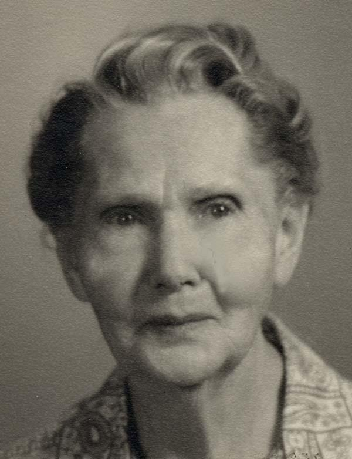

# The Life Story of Ellen Precinda Moffett Done

###Daughter of Joseph A. and Olive C.E. Moffett
---

**Born May 14, 1883 - St. Johns, Apache, Arizona**  
**Died August 4, 1975 - Salt Lake City, Salt Lake, Utah**

**Lovingly known as "Nellie" to family and friends**

#####Compiled by her daughters:
*Olive Done Hall*  
*Pearl Done Hill*  
*1981 - 1982*

#####Formatted for eBook and reprinting by
*Stephen Reed Done*  
*2016*

